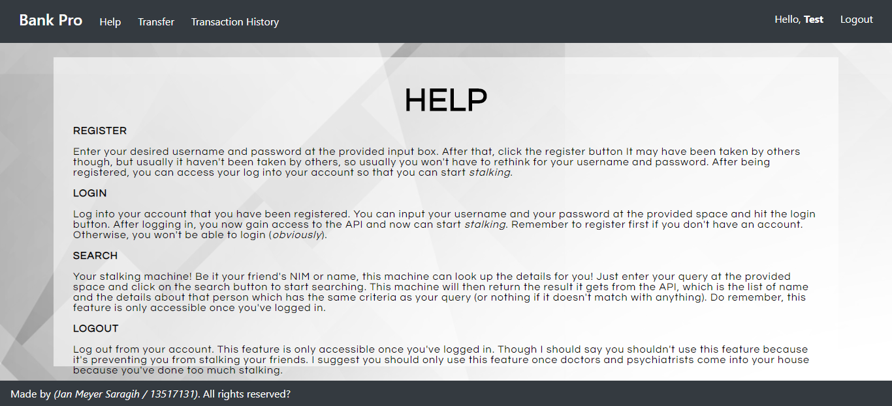
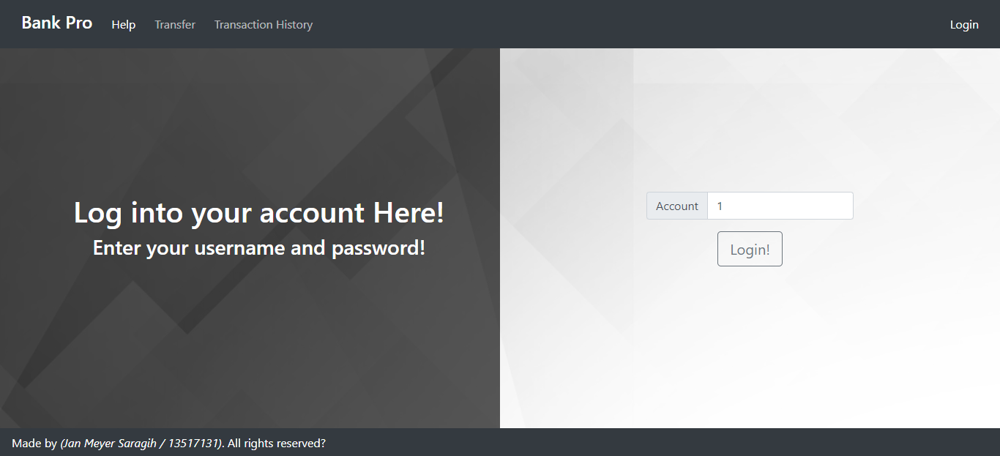
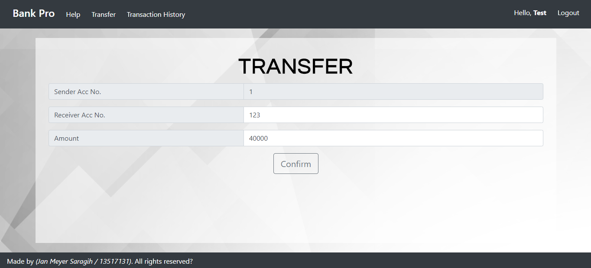
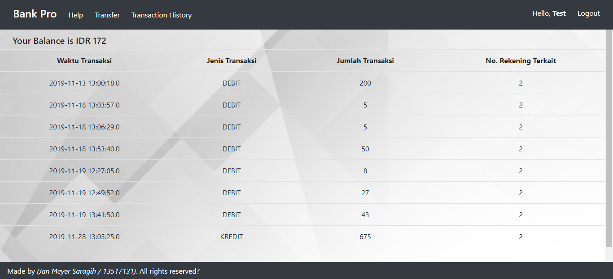

# Bank Pro

Sebuah aplikasi frontend yang menggunakan ReactJS untuk melakukan aplikasi layaknya sebuah bank.

## Pemrograman Aplikasi Berbasis Web

### Deskripsi aplikasi Bank
Aplikasi Bank Pro berfungsi untuk melakukan:
- Login: masuk ke dalam akun yang ada
- Transfer: transfer uang dari satu akun ke akun lain
- Transaction History: melihat riwayat transaksi pengguna

### Screenshot
##### Home Page
 

##### Help Page
 

##### Login Page
 

##### Transfer Page
 

##### Transaction History Page
 

## Dasar Pengembangan Perangkat Lunak

### Pembagian Kerja
- CI / CD : 13517131, 13515116, 13517008
- Eksplorasi dan setup mesin deployment : 13517131
- Unit Testing : 13517131

### URL
http://54.210.33.100:3000/

